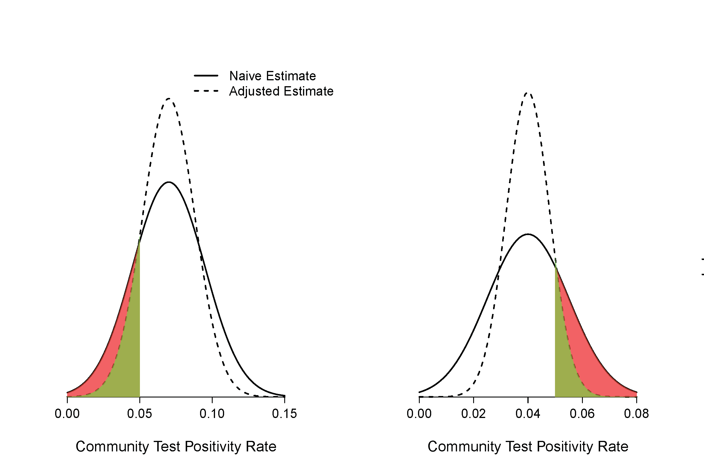

<!-- README.md is generated from README.Rmd. Please edit that file -->

```{r, include = FALSE}
knitr::opts_chunk$set(
  collapse = TRUE,
  comment = "#>",
  fig.path = "man/figures/README-",
  out.width = "100%"
)
```

# Test Positivity Rate Distribution Dashboard 

<!-- badges: start -->
[](https://www.tidyverse.org/lifecycle/#experimental)
<!-- badges: end -->

The goal of Test Positivity Rate Distribution Dashboard is to estimate of the distribution of COVID-19 test positivity rates in communities.

## Installation

You can install the development version from [GitHub](https://github.com/) with:

```{r eval=FALSE}
install.packages("devtools")
devtools::install_github("alexanderjwhite/covid_proportion_estimation")
```

## Access App

There are two ways to access the app:

* [https://alexanderjwhite.shinyapps.io/covid_proportion_estimation/](https://alexanderjwhite.shinyapps.io/covid_proportion_estimation/)
* from the package (see below)

```{r eval=FALSE}
run_app()
```

## Instructions

Welcome to the dashboard of the distribution of test positivity rate. This application is designed to estimate the distribution of test positivity rate among local communities. As an example, COVID-19 testing data in each zip code collected by the city of Chicago has been pre-loaded. In the *View* Data section, the loaded data are displayed with each row representing data from a zip code. The *Results* section displays the estimates of the proportion of zip code areas with a test positivity rate below various upper thresholds. The *Customized Results* section displays the proportion of zip code areas with a test positivity rate between arbitrary lower threshold and upper threshold.

1. Format your data as shown in the image below. The first row should contain the column names. Each row in the column named *tests* should contain the number of tests performed. Each row in the column named *cases* should contain the number of positive test results. Acceptable formats include *.csv*, *.xlsx*, and *.xls*.

2. Navigate to the Upload tab.

3. Select Browse and upload your file.

4. A table of default positive rate proportion will populate in the Results table. Estimate the positive rate proportion for a custom range by adjusting the sliding bar and selecting Update.

## Background

The distribution of COVID-19 test positivity rate in communities can be used to guide public health and policy responses. Specifically, the proportion of local communities (e.g. zip code areas) with a test positivity rate below an upper threshold (or above a lower threshold) offers important insight on the disease control within a city or county. For instance, if 10 out of 50 zip code areas in a city have a test positivity rate below an upper threshold of 5% then  the naïve estimate of the proportion is $\frac{10}{50}=0.2$. The naïve estimate, however, ignores the margin of error of the test positivity rate in each zip code, which could lead to either over- or under-estimate of the proportion. This online application uses a statistical method called Bayesian deconvolution to generate a more accurate estimate.



### Figure 1

Illustration on how the native calculation can result in overly-optimistic or overly-pessimistic estimate of the proportion of community-level test positivity rate below a threshold.

### Legend

The figure on the left side shows one scenario where the naïve estimate will overestimate the proportion of community level test positivity rate of 5% or less as compared with estimate that accounts for the margin of errors (adjusted estimate). The red area indicates the magnitude of over-optimism. The figure on the right side shows one scenario where the naïve estimate will overestimate the proportion of community level test positivity rate of 5% or more. The red area indicates the magnitude of over-pessimism.

## Technical Details

Suppose there are $n$ communities. Let $t_i$ and $c_i$ be the number of tests and cases in a given period of time for community $i$ $(i = 1,2,\ldots,n)$. The naïve estimate of the test positivity rate for community $i$, $\hat{r}_i = c_i/t_i$, has a margin of error in estimating the *true* test positivity rate $r_i$. Here the true test positivity rate refers to the rate that would have been calculated had we been able to test all eligible subjects in the community. The margin of error associated with $\hat{r}_i$  in estimating $r_i$ can be estimated by $1.96 \times \sqrt{\hat{r}_i (1-\hat{r}_i)/t_i}$.

The naïve estimate of the proportion of communities with test positivity rate below threshold $r_0$ is 

$$\hat{p}(r_0)=\frac{\sum_{i=1}^n I(\hat{r}_i \leq r_0)}{n},$$

where $I(\cdot)$ is the indicatory function. Because of the margin of errors associated with $\hat{r}_i, \hat{p}(r_0)$ could be a biased estimate of the true proportion 

$$p(r_0)=\frac{\sum_{i=1}^n I(r_i \leq r_0)}{n}.$$

A solution that accounts for the margin of errors is the empirical Bayes deconvolution method. In this approach, the distribution induced by the rates $r_i (i=1,2,\cdots,n), g(r)$, is assumed to be a natural cubic spline with knots at equally spaced quantiles and can be estimated through either maximum likelihood or regularized maximum likelihood method using data $(t_i,c_i) (i=1,2,\ldots,n)$. We used maximum likelihood method with Bayesian Information Criteria (BIC) as the tool to select model degrees of freedom up to 5. Once we obtain an estimate $\hat{g}(r)$, we can estimate $p(r_0)$ by 

$$\tilde{p}(r_0) = \int_0^{r_0}\hat{g}(r)dr.$$

$\tilde{p}(r_0)$ can be a much more accurate estimate of $p(r_0)$ than $\hat{p}(r_0)$.

## References

1. Efron B. Empirical Bayes deconvolution estimates. *Biometrika*. 2016;103(1):1-20.
2. Narasimhan B, Efron B. deconvolveR: A G-Modeling Program for Deconvolution and Empirical Bayes Estimation. *Journal of Statistical Software*. 2020;94(11).
